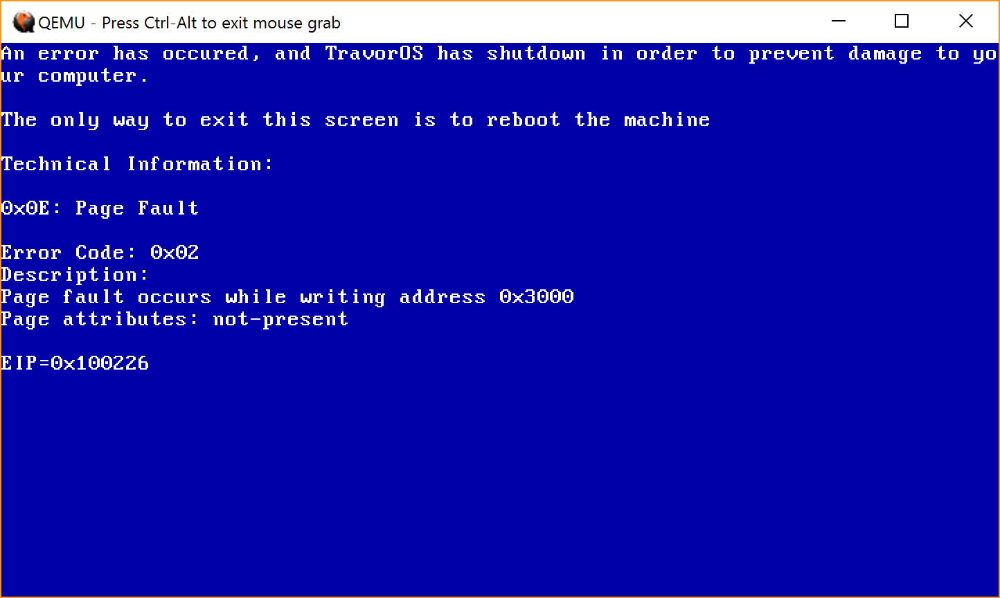

# TravorOS - Developing with Simplification

This is the first [Operating System](https://en.wikipedia.org/wiki/Operating_System "Operating System Definition") I created. It's written in two languages: C language and Assembly.

This project has been activated since [December 15, 2017](https://github.com/TravorLZH/TravorOS/blob/master/ChangeLog.md#01-r0-2017-12-15)

## Table of Contents

* [Bootloader](#bootloader)

	* [Custom](#bootloader)

		* [Boot Sector](#boot-sector)

		* [Stage 2](#stage-2)

	* [GRUB](#grub)

* [Kernel](#kernel)

* [Memory Management](#memory-management)

* [Building System](#building-system)

## Bootloader

### Custom

This OS uses a 2-staged bootloader. In case the second stage is when we entered **Protected Mode** and calls kernel.

#### Boot Sector

The first 512 bytes of my floppy image contains the Boot Sector which does a lot of stuff that **Protected Mode** cannot do. (e.g. Loading stuff from disk). Then it jumps to the second stage loaded at `0x7E00` (just after the boot sector).

#### Stage 2

This stage loads the GDT and enters **Protected Mode**, then it copies the kernel loaded by boot sector at `0x1000` to `0x100000` (1 MB). At last jump!

### GRUB

The size of the kernel is always growing, but I can't always increase the sectors to load. As a solution. I decide to use GRUB. The kernel is stored as an ELF image (`kernel.img`) in a CD which uses `ISO 9660` as its file system. GRUB also supports multiboot, so my Operating System can work together with others (Windows, Linux, etc.).

## Kernel

We entered protected mode which means we don't have access to BIOS functions. So, this kernel needs to re-implement those functions for controlling the hardware.

Now, I have re-implemented standard devices: screen and keyboard. In the further development. I am going to implement disk driver.

## Memory Management

This Operating System uses both segmentation and paging to provide memory protection. In my **Global Descriptor Table**, I put 5 segment descriptors:

1. **Null Segment**

1. **Code Segment for kernel**: The segment where my kernel code belongs to

1. **Data Segment for kernel**: The segment where my kernel global variables belong to

1. **Code Segment for user**: Currently not using

1. **Data Segment for user**: Same as 4

I also enable paging. Now I intentionally maped the fourth page in the first page table to `not-present` and `read-only`, so you can generate a **Page Fault** by executing entering `page` in my OS's command line.

## Building System

This project uses [GNU Make](https://www.gnu.org/software/make "GNU Make Homepage") to build. So, the way to build is to type `make`, if any problems occur during the build, type `make dep` before `make`.

If you are not using Linux or WSL (Windows Subsystem for Linux), you will need to [download a cross compiler from here](https://github.com/nativeos/i386-elf-toolchain/releases). Then you need to modify `CC` and `LD` in `config.mk`.
